  
[]()
[](https://www.oracle.com/java/technologies/javase-jdk11-downloads.html)
[](https://cytoscape.org/download.html)
## Installation
### Cytoscape install
- Apps > App manager
- Search IntActApp
- Click on Install

### JAR install
Download the release jar or compile it to obtain intactApp.jar.  
Then to install it:
- from Cytoscape
    - Open Cytoscape
    - Apps > App manager > Install from file ...
    - Select intactApp.jar
- from system
    - Place intactApp.jar in `~/CytoscapeConfiguration/3/apps/installed/`
      
## User guide

### Search network
#### Search network interactors
To search an IntAct network, go on the left panel, under the network menu  
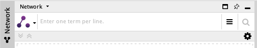  
By clicking on the left icon, you can select the search mode you are interested in.  
IntAct App provide two of them:
- Fuzzy Search
    - Search the terms you gave among interactors data :
        - id : eg. Q5S007, EBI-5323863, CHEBI:15996
        - name : eg. LRRK2, GTP
        - aliases : eg. Dardarin, Park8, guanosine triphosphate
        - description : eg. Leucine-rich repeat serine/threonine-protein kinase 2  
    - You can use it to search broad thematics like tumor, kinase, cell-cycle... 
    - You can also use it to query specific interactors like GTP, but you will also obtain most GTP related proteins 
    like GTPase, because their description contains GTP.  
- Exact Query
    - Query the terms you gave among reduced interactors data :
        - id : eg. Q5S007, EBI-5323863, CHEBI:15996
        - name : eg. LRRK2, GTP
        - aliases : eg. Dardarin, Park8, guanosine triphosphate
    - You can use it when you have a list of known proteins or gene. 
    - Will only ask to choose between several interactors if there is ambiguity on which proteins you meant to select.


You can then enter different terms you want to search inside the bar.  
Each term should be separated by a new line.  
Terms are not case-sensitive (LRRK2 ==> Lrrk2, LRRK2) and accept * as joker card (LRR* ==> LRRK2, LRR-RLK, Lrrk2).  
You can provide search options by clicking on .  
When your query is ready, click on  or press Ctrl + Enter (Cmd + Enter on MacOS).

#### Resolve interactors
Now, you need to select which interactors that matched your terms will be used as seed to grow your network around.  
Depending on the option selected at the bottom of the window, you can either build your network 
between the interactors you have selected as seeds, or also include every interacting partners of these seeds 
found inside IntAct.  
If more interactors matched your terms than the limit defined in the options, you can include 
all the interactors that you cannot see by clicking on the last row of the term.  
You can filter visible interactors by their species and their type.  
Once satisfied by the interactors you have selected as seeds, and the options selected, you can hit the "Build Network" button.


### Right panel
#### 1. IntAct views
IntAct network edges represent evidence of interactions between two molecular interactors.  
IntAct App provide 3 different ways to visualize those edges:
- Summary : All evidence edges between 2 interactors are summarized into a single edge colored by its MI Score
- Evidence : All evidence edges are visible, and their color matches the type of interaction found.
- Mutation : Same as expanded except that it highlights evidences which involves a mutation.

You can switch between those 3 views with   
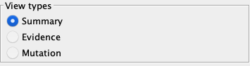  
Underneath this panel, you will find 3 different panels.
#### 2. Legend
Inside this panel, you will find the legend of the default IntAct style for the view type selected.  
By clicking on a species inside the _Node color_ section, you will be able to change the color associated with this species.  
Most common species have their own default color, but all others are colored according to their belonging to some superior taxon.  
For each of these _uncommon_ species, you can define a specific color by clicking on 
#### 3. Nodes and Edges
When you select nodes and edges, you will be able to see details on these selected elements inside their respective panel
  
Inside these panel, you will also be able to hide nodes and edges according to their specific data.

## Developer guide
### Compilation
To compile and obtain the app jar 
```bash
cd ${INTACT_APP_ROOT}
mvn install
```

### Installation
Automatic install after compilation :
```bash
ln -s ${INTACT_APP_ROOT}/target/intactApp-1.0.0.jar ~/CytoscapeConfiguration/3/apps/installed/intactApp.jar
```
Manual install: See [JAR install](#jar-install)

        
### Data handling process
We differentiate 2 kinds of data received by webservices: 

- Table data
- Detail  

We receive the first one directly after the query, and is stored inside the tables.  
All features of IntAct app must rely on table data because detail data is not persistent and not considered by Cytoscape (Styles, filters, etc.).  
Detail data is here just to provide advanced topics to user without impacting too much query performances (Cross references, etc.).   

Here is the standard way of handling table data:

#### 1. Table fields/column declaration

In model.tables.fields.models package, you'll find table models which allow you to declare new fields.  
Each field correspond to a column in the related table. Therefore, you should put new fields in the corresponding class.  
Creating a field :

- Allow easy access to these fields from anywhere in the code with getValue and setValue methods
- Automatically add the column in the related table 
- Automatically fill this the column data if you provide a jsonKey.

> WARNING on the automatic filling: it only works if the data coming from webservice is in first level of corresponding JsonNode
>
> - NodeFields ==> `nodes[i]`
> - EdgeFields ==> `edges[i]`
>
> For instance, participant data which are under `edges[i].source` and `edges[i].target` in Json should be set in the tables
> manually in the corresponding ModelUtils method, here `ModelUtils.fillParticipantData()`.  
> In the same way, data that needs manual adjustments from raw Json (eg. Edge name) or that aren't in Json (eg. Network, Features and Identifiers UUID)
> should also be handled in their corresponding ModelUtils methods (eg. `ModelUtils.createEdge()` and `ModelUtils.initLowerTables()`)

#### 2. Core data 

After having declared your field, you should provide access to it inside model.core package.   
Classes inside this package transform raw table data into cohesive data object, easier to manipulate.  
As such, they provide utility methods to grant access to their data like collection of features for both nodes and edges.  
They are also responsible for the querying, and the memory handling of the lazily loaded details.

The core architecture is the following:

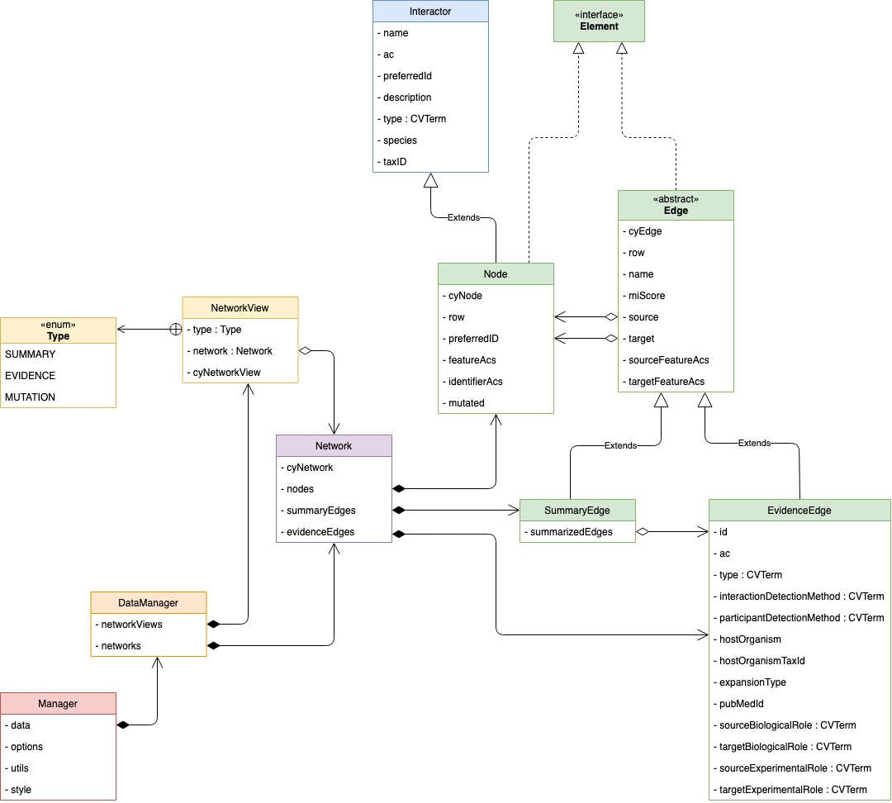
If you add a column which is a MI or a PAR identifier of some other field, we advise you to add it as an OntologyIdentifier inside these core classes.  
OntologyIdentifier allow easy access to:

- User info url : provide to users definition of controlled vocabulary terms
- Details url : url to OLS API to provide CV term details such as their description, synonyms, etc.
- Descendant url : url to OLS API to get all children CV terms of the current one. (Used in styling)


#### 3. User Interface

To represent the newly added data visually, IntAct App uses the package `ui`. Inside it, we define several custom 
components in `ui.components` which are used among the different panels in `ui.panels`. Most of IntAct App displaying 
of data occurs in the `ui.panels.detail.DetailPanel`. which is the right panel in Cytoscape. 
This detail panel is organised as shown in the following diagrams:

Detail Panel  
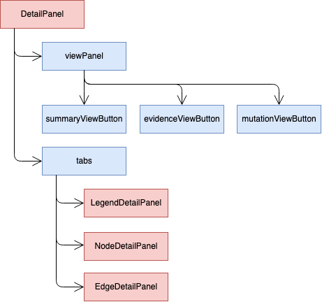  
> Legend Panel
>
> 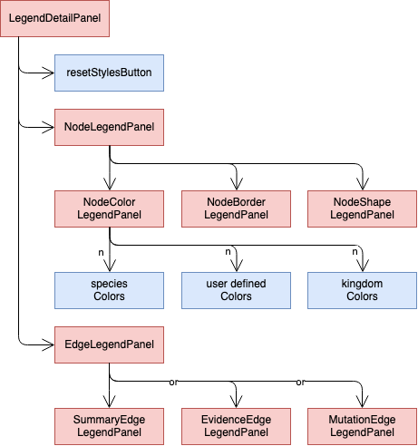

> Node Panel
>
> 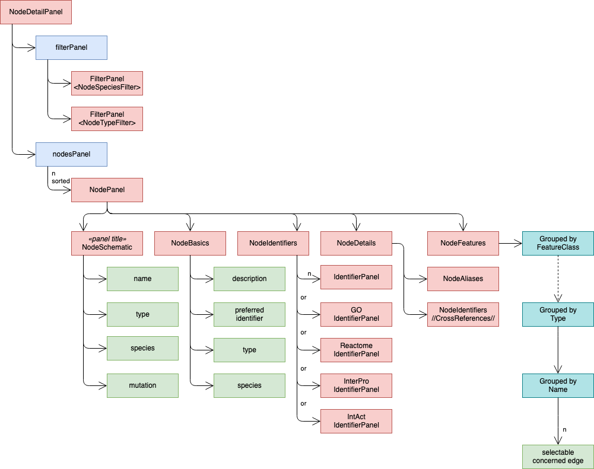


>  Summary Edge Panel
>
> 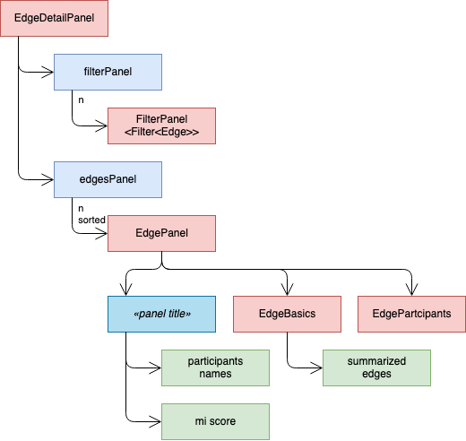
> > 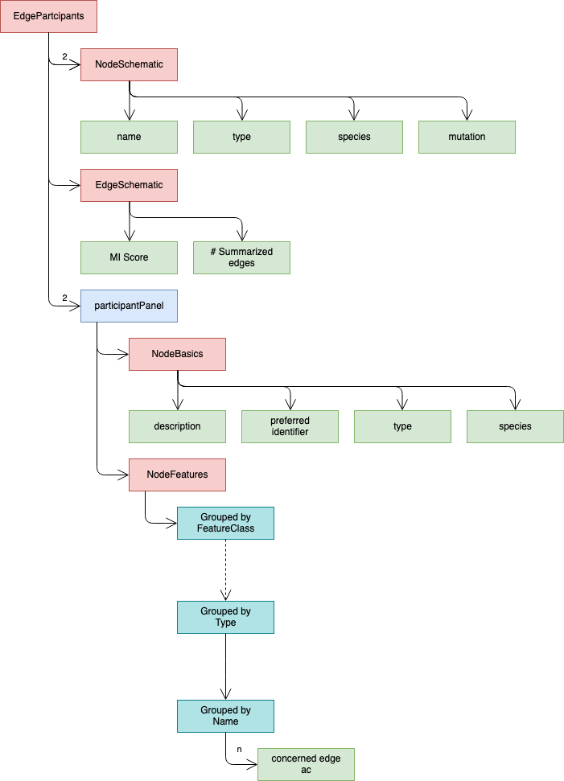


> Evidence Edge Panel
>
> 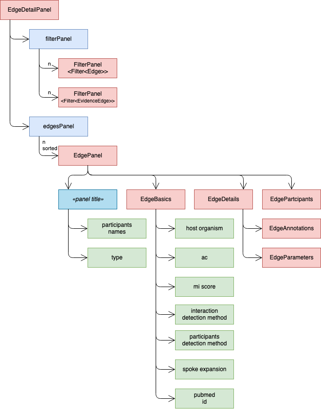
> > 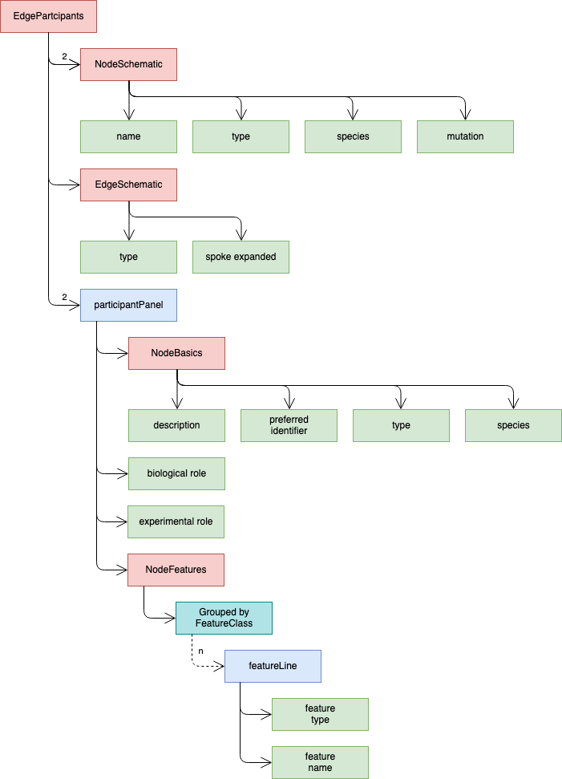

### Filters
Filters are defined within the `model.filters` package. they follow the following architecture:

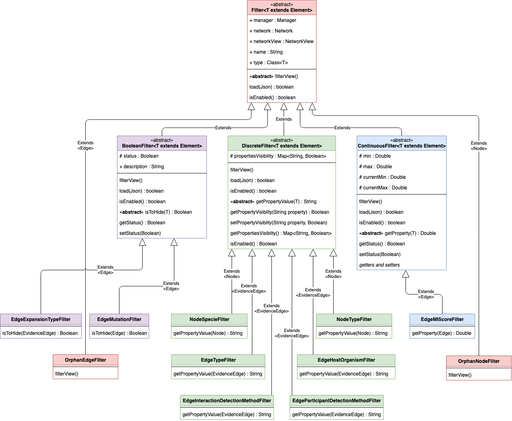

If you need to add new filters, you should therefore make them inherit the correct Filter type 
(Boolean, Discrete or Continuous) and use the proper element you want to filter.  

To use it, it must be instantiated in `NetworkView.setupFilters()`. This will trigger automatically: 
- The indexing of the current view data to initialize the filter.
- The save/load of the filter state ins session files
- The display of the corresponding UI for the given filter. 
- The functionality of the filters linked with UI
The UI panel used is based on the type, while it is placed in the correct panel thanks to the generic parameter used.

The different filter UI panels are defined in `ui.panels.filters` as follows:

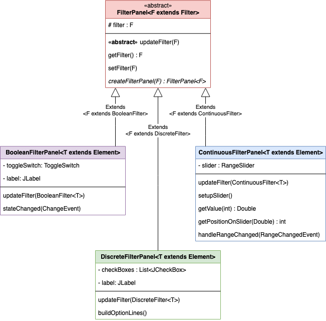

### Network creation process

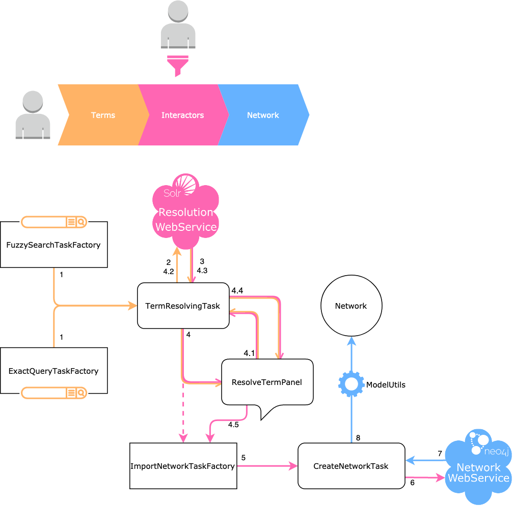
