## Compilation

To compile and obtain the app jar

```bash
cd ${INTACT_APP_ROOT}
mvn install
```

## Installation

Automatic install after compilation :

```bash
ln -s ${INTACT_APP_ROOT}/target/intactApp-1.0.0.jar ~/CytoscapeConfiguration/3/apps/installed/intactApp.jar
```

Manual install: See [JAR install](#jar-install)

## Run and Debug in IntelliJ IDEA

### Run with error logs

In order to run the application and see the different system logs, you'll need to run cytoscape.sh. This file is at the
root of the installation folder of Cytoscape.

e.g. on MacOS, with Cytoscape version 3.8.2
> /Applications/Cytoscape_v3.8.2/cytoscape.sh

To debug, you just need to add debug as a parameter to this cytoscape.sh

To do so inside IntelliJ, there are two ways of doing it :

- BashSupport Pro plugin
    - Paid license but grants usual run config
    - Add configurations / Edit configurations
        - Add New Configuration (⌘N) > **BashSupport Pro**
            - Name = Cytoscape
            - Source = File
            - Path = /Applications/Cytoscape_v3.8.2/cytoscape.sh
            - Before launch > Add (⌘N)
                - Run maven goal
                - Choose correct Working Directory
                - Command line = install
        - Copy the newly created configuration and edit to match
            - Name = Cytoscape Pre-Debug
            - Program arguments = debug
        - Add New Configuration (⌘N) > **Remote JVM Debug**
            - Name = Debug
            - Port = 12345
    - To use them, select the desired config and hit the run (^R) / debug (^D) button
        - For debug, run first pre-debug, then debug
- External Tool
    - Free, but no usual run config
    - Preferences (⌘,) > Tools > External Tools
    - Add (⌘N)
        - Name = Cytoscape
        - Program = /Applications/Cytoscape_v3.8.2/cytoscape.sh
    - Copy newly created external tool
        - Rename it = Cytoscape Debug
        - Arguments = debug
    - To use them, Tools > External Tools > ${ToolName}
        - For debug, you'll need to click on the `Attach debugger`
          that appears on the `Run` tab to actually launch Cytoscape
    - (Optional) Add shortcut to launch them more easily
        - Preferences (⌘,) > Keymap
        - On the search box, type External tools
        - Right click on the desired tool > Add new keyboard shortcut
        - For MacOS, we recommend
            - Cytoscape = ^⎇⌘R
            - Cytoscape Debug = ^⎇⌘D
    
> No matter the chosen option, you can reload the application inside 
> Cytoscape without having to rerun the Configuration / Tool 
> by running `mvn install` (Double-click on Maven panel > IntAct App > Lifecycle > install)  
> The symbolic link will automatically update it on the folder, and Cytoscape will reload the new JAR  
> You'll only need to rerun the cytoscape.sh if Cytoscape is crashing, not if the app is crashing

## Data handling process

We differentiate 2 kinds of data received by webservices:

- Table data
- Detail

We receive the first one directly after the query, and is stored inside the tables.  
All features of IntAct app must rely on table data because detail data is not persistent and not considered by
Cytoscape (Styles, filters, etc.).  
Detail data is here just to provide advanced topics to user without impacting too much query performances (Cross
references, etc.).

Here is the standard way of handling table data:

### 1. Table fields/column declaration

In model.tables.fields.models package, you'll find table models which allow you to declare new fields.  
Each field correspond to a column in the related table. Therefore, you should put new fields in the corresponding
class.  
Creating a field :

- Allow easy access to these fields from anywhere in the code with getValue and setValue methods
- Automatically add the column in the related table
- Automatically fill this the column data if you provide a jsonKey.

> WARNING on the automatic filling: it only works if the data coming from webservice is in first level of corresponding JsonNode
>
> - NodeFields ==> `nodes[i]`
> - EdgeFields ==> `edges[i]`
>
> For instance, participant data which are under `edges[i].source` and `edges[i].target` in Json should be set in the tables
> manually in the corresponding ModelUtils method, here `ModelUtils.fillParticipantData()`.  
> In the same way, data that needs manual adjustments from raw Json (eg. Edge name) or that aren't in Json (eg. Network, Features and Identifiers UUID)
> should also be handled in their corresponding ModelUtils methods (eg. `ModelUtils.createEdge()` and `ModelUtils.initLowerTables()`)

### 2. Core data

After having declared your field, you should provide access to it inside model.core package.   
Classes inside this package transform raw table data into cohesive data object, easier to manipulate.  
As such, they provide utility methods to grant access to their data like collection of features for both nodes and
edges.  
They are also responsible for the querying, and the memory handling of the lazily loaded details.

The core architecture is the following:

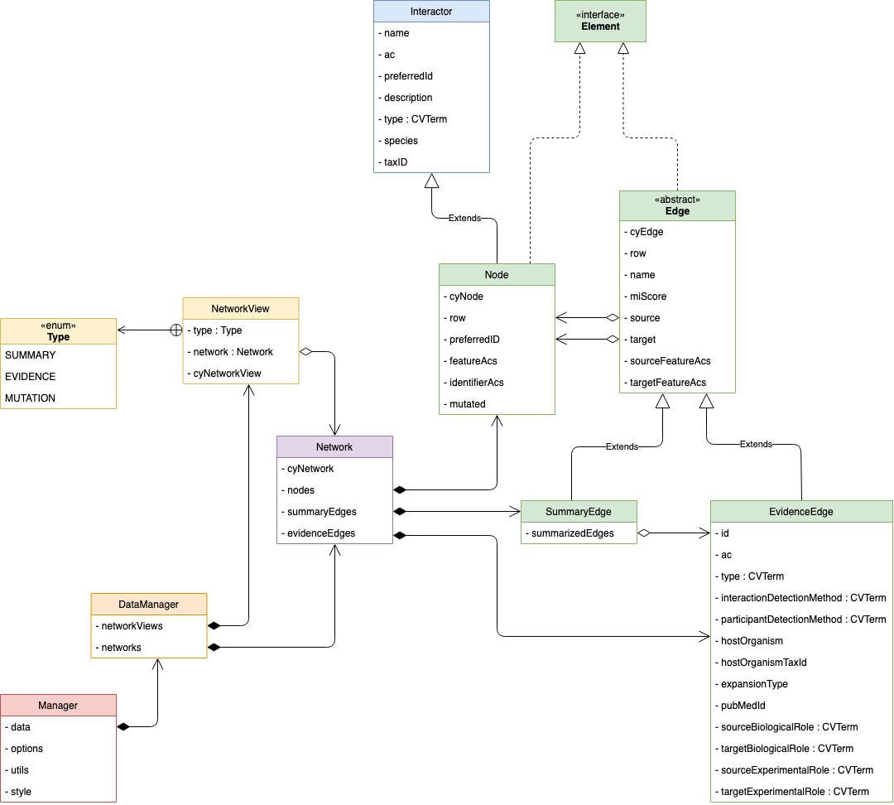
If you add a column which is a MI or a PAR identifier of some other field, we advise you to add it as an
OntologyIdentifier inside these core classes.  
OntologyIdentifier allow easy access to:

- User info url : provide to users definition of controlled vocabulary terms
- Details url : url to OLS API to provide CV term details such as their description, synonyms, etc.
- Descendant url : url to OLS API to get all children CV terms of the current one. (Used in styling)

### 3. User Interface

To represent the newly added data visually, IntAct App uses the package `ui`. Inside it, we define several custom
components in `ui.components` which are used among the different panels in `ui.panels`. Most of IntAct App displaying of
data occurs in the `ui.panels.detail.DetailPanel`. which is the right panel in Cytoscape. This detail panel is organised
as shown in the following diagrams:

Detail Panel  
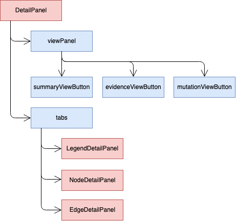
> Legend Panel
>
> 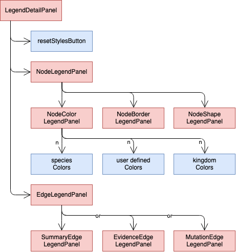

> Node Panel
>
> 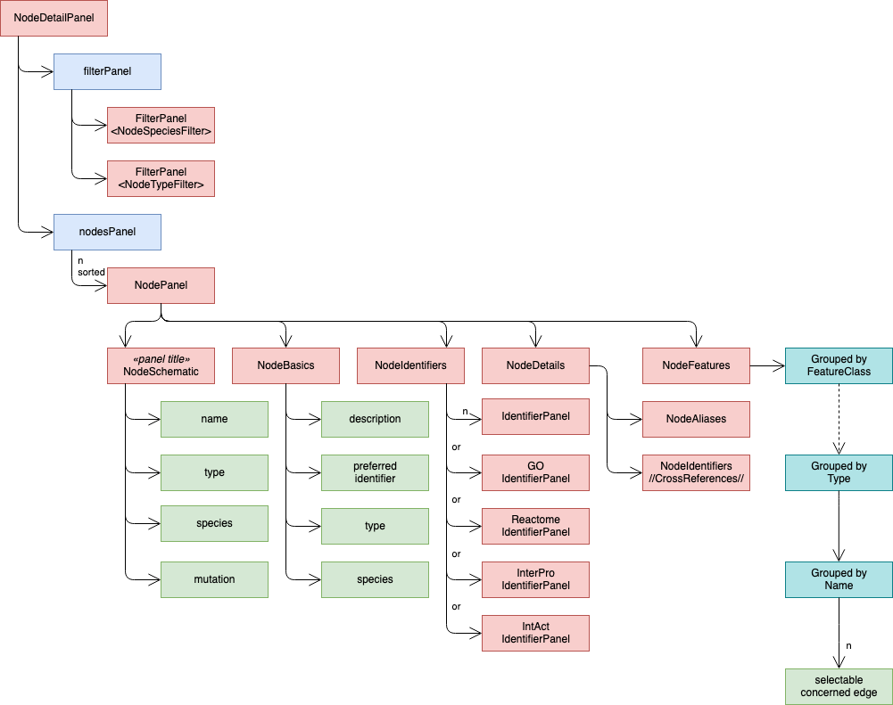


> Summary Edge Panel
>
> 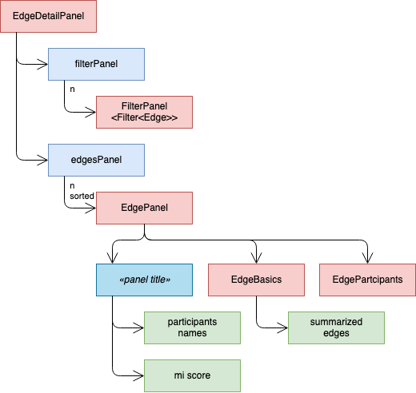
> > 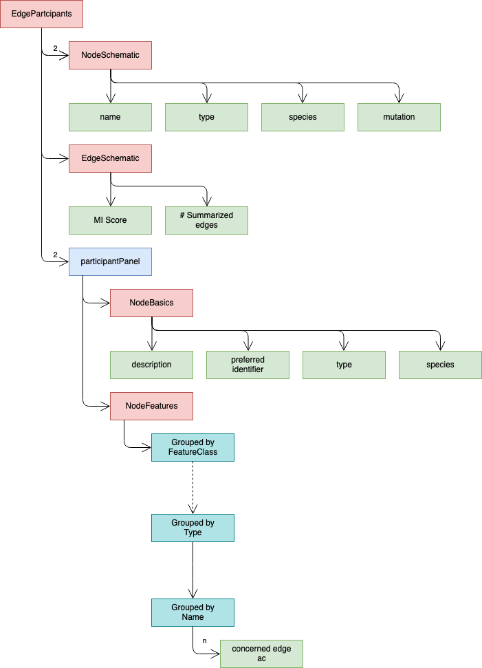


> Evidence Edge Panel
>
> 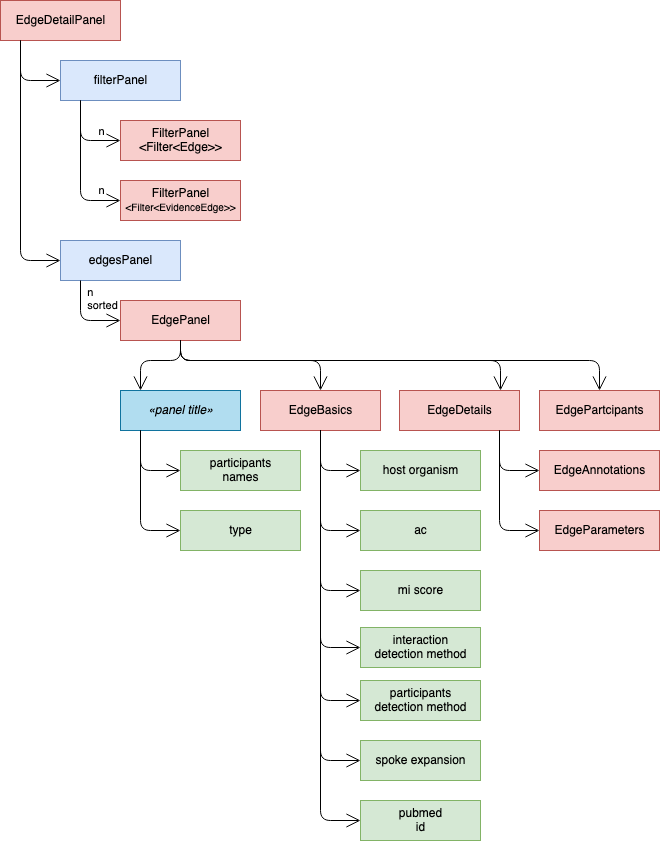
> > 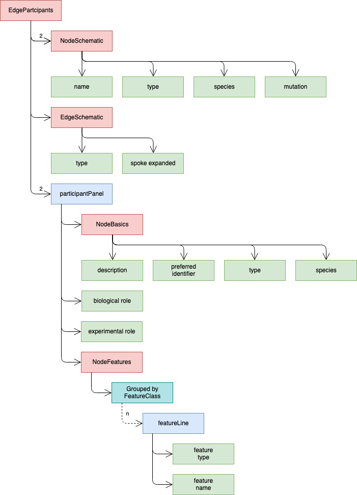

## Filters

Filters are defined within the `model.filters` package. they follow the following architecture:

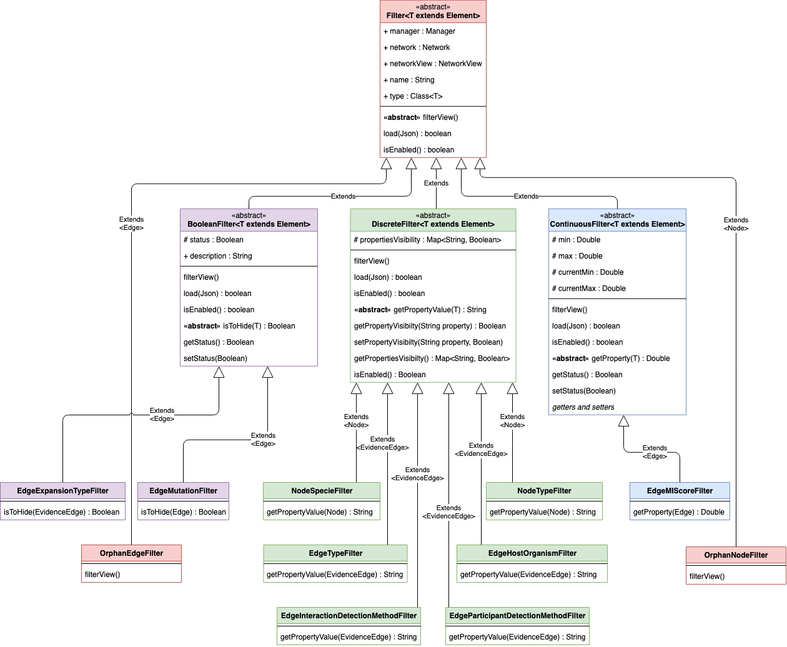

If you need to add new filters, you should therefore make them inherit the correct Filter type
(Boolean, Discrete or Continuous) and use the proper element you want to filter.

To use it, it must be instantiated in `NetworkView.setupFilters()`. This will trigger automatically:

- The indexing of the current view data to initialize the filter.
- The save/load of the filter state ins session files
- The display of the corresponding UI for the given filter.
- The functionality of the filters linked with UI The UI panel used is based on the type, while it is placed in the
  correct panel thanks to the generic parameter used.

The different filter UI panels are defined in `ui.panels.filters` as follows:

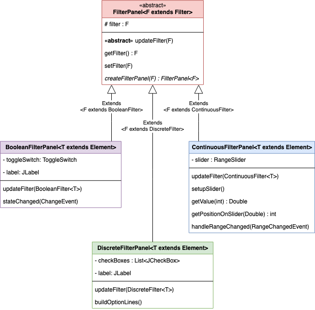

## Network creation process

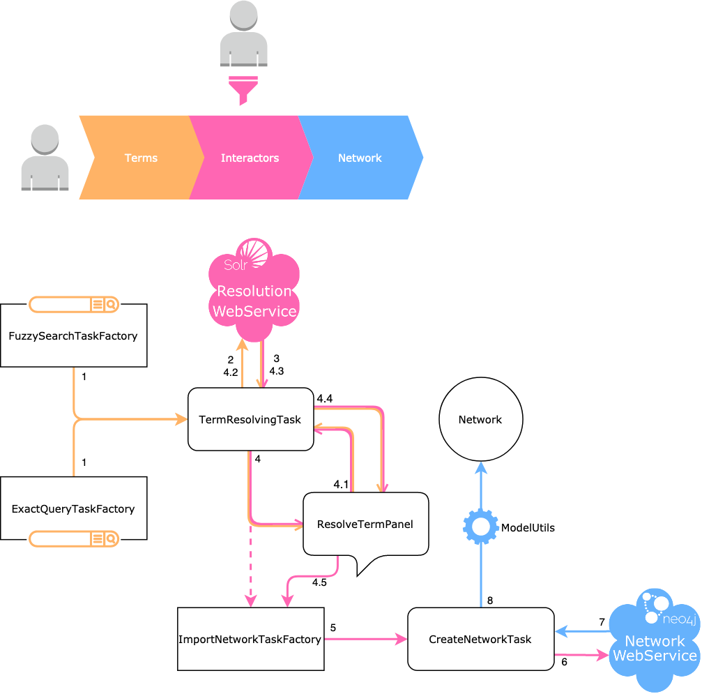