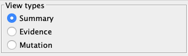

# User guide

## Search network
### Search network interactors
To search an IntAct network, go on the left panel, under the network menu  
  
By clicking on the left icon, you can select the search mode you are interested in.  
IntAct App provide two of them:
- Fuzzy Search
    - Search the terms you gave among interactors data :
        - id : eg. Q5S007, EBI-5323863, CHEBI:15996
        - name : eg. LRRK2, GTP
        - aliases : eg. Dardarin, Park8, guanosine triphosphate
        - description : eg. Leucine-rich repeat serine/threonine-protein kinase 2  
    - You can use it to search broad thematics like tumor, kinase, cell-cycle... 
    - You can also use it to query specific interactors like GTP, but you will also obtain most GTP related proteins 
    like GTPase, because their description contains GTP.  
- Exact Query
    - Query the terms you gave among reduced interactors data :
        - id : eg. Q5S007, EBI-5323863, CHEBI:15996
        - name : eg. LRRK2, GTP
        - aliases : eg. Dardarin, Park8, guanosine triphosphate
    - You can use it when you have a list of known proteins or gene. 
    - Will only ask to choose between several interactors if there is ambiguity on which proteins you meant to select.

You can then enter different terms you want to search inside the bar.  
Each term should be separated by a new line.  
Terms are not case-sensitive (LRRK2 ==> Lrrk2, LRRK2) and accept * as joker card (LRR* ==> LRRK2, LRR-RLK, Lrrk2).  
You can provide search options by clicking on .  
When your query is ready, click on  or press Ctrl + Enter (Cmd + Enter on MacOS).

### Resolve interactors
Now, you need to select which interactors that matched your terms will be used as seed to grow your network around.  
Depending on the option selected at the bottom of the window, you can either build your network 
between the interactors you have selected as seeds, or also include every interacting partners of these seeds 
found inside IntAct.  
If more interactors matched your terms than the limit defined in the options, you can include 
all the interactors that you cannot see by clicking on the last row of the term.  
You can filter visible interactors by their species and their type.  
Once satisfied by the interactors you have selected as seeds, and the options selected, you can hit the "Build Network" button.

## Right panel
### 1. IntAct views
IntAct network edges represent evidence of interactions between two molecular interactors.  
IntAct App provide 3 different ways to visualize those edges:
- Summary : All evidence edges between 2 interactors are summarized into a single edge colored by its MI Score
- Evidence : All evidence edges are visible, and their color matches the type of interaction found.
- Mutation : Same as expanded except that it highlights evidences which involves a mutation.

You can switch between those 3 views with   
  
Underneath this panel, you will find 3 different panels.
### 2. Legend
Inside this panel, you will find the legend of the default IntAct style for the view type selected.  
By clicking on a species inside the _Node color_ section, you will be able to change the color associated with this species.  
Most common species have their own default color, but all others are colored according to their belonging to some superior taxon.  
For each of these _uncommon_ species, you can define a specific color by clicking on 
### 3. Nodes and Edges
When you select nodes and edges, you will be able to see details on these selected elements inside their respective panel
  
Inside these panel, you will also be able to hide nodes and edges according to their specific data.